# Lab 6: Setup FSLogix

## **Scenario**

Contoso was getting complaints from the end-users stating that they were losing their User Profile when they connected to a different session host. Contoso wants to implement FSLogix which will help the end users to have separate storage containers for their user data and will help in maintaining consistency. You will help Contoso implement FSLogix in the Azure virtual desktop environment.

## **Overview**

The Azure Virtual Desktop service, recommends FSLogix profile containers as a user profile solution. FSLogix is designed to roam profiles in remote computing environments, such as Azure Virtual Desktop. It stores a complete user profile in a single container. At sign-in, this container is dynamically attached to the computing environment using natively supported Virtual Hard Disk (VHD) and Hyper-V Virtual Hard disk (VHDX). The user profile is immediately available and appears in the system exactly like a native user profile. This article describes how FSLogix profile containers are used with the Azure Files function in Azure Virtual Desktop.

## Exercise 1: Create Storage account and file share

In the following task, we will be creating a storage account with a file share which will be used to store user profiles for FSlogix.

1. Navigate to the Azure portal, search for **Storage accounts** in the search bar, and select **Storage accounts** from the suggestions.

   
   
2. Click on **+ Create** to create a new storage account.

   

3. Use the following configuration for the storage account.
   
   - Subscription: Leave it to ***default***.
   
   - Resource Group: *Select **AVD-RG** from the drop-down*. 
   
   - Storage account name: **<inject key="Storage Account Name" />**   
      
   - Region: Select **<inject key="Region" />** from the drop-down list.  
   
   - Performance: **Standard**   
   
   - Replication: **Geo-redundant storage (GRS)**
   
   - **Select** Make read access to the data available in the event of regional unavailability.
   
   - At last, click on **Next**
   
   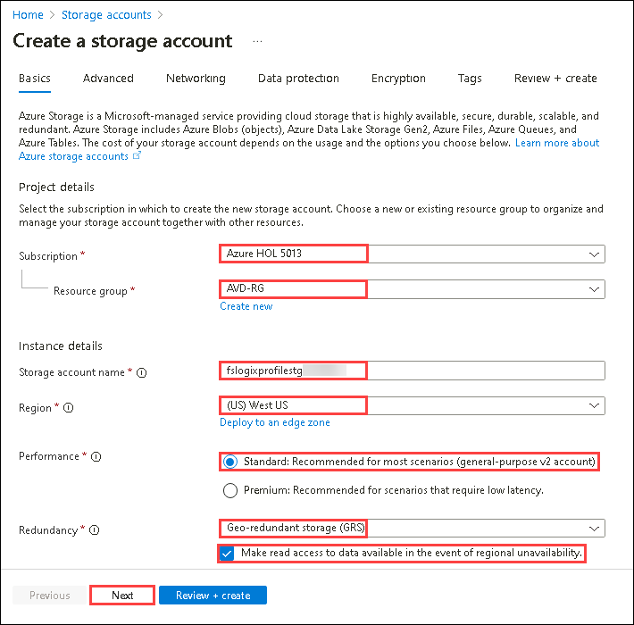
   
4. On the _Advanced_ tab, leave it to default and click on the **Next: Networking >** tab, make sure to enable **Require secure transfer for REST API operations**, **Allow enabling anonymous access on individual containers**, and **Enable storage account key access** options. Once enabled, click on the **Next: Networking >** button.

   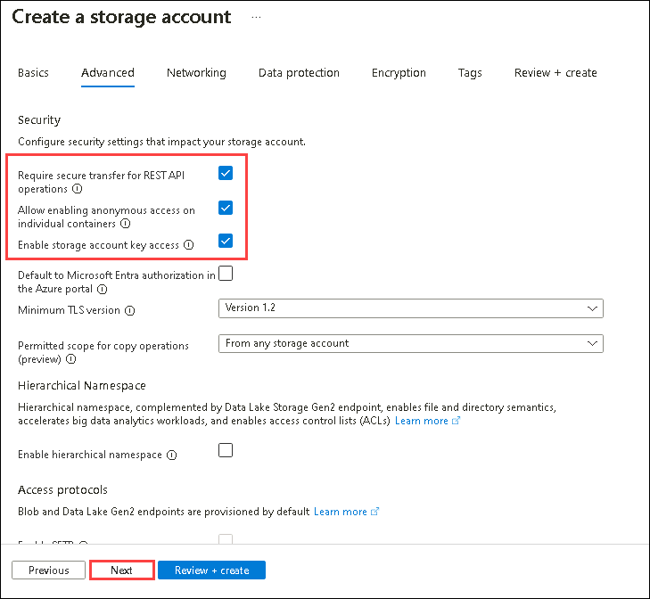

5. In the _Networking_ tab, use the following configurations:

   - Network access: **Enable public access from selected virtual networks and IP addresses (1)**
     
   >**Note:** This will make sure that your storage account is not accessible from the public network, making it more secure.
   - Virtual network subscription: Leave it to ***default (2)***.
   - Virtual Network: **aadds-vnet (3)**
   - Subnets: **sessionhost-subnet (10.0.1.0/24) (4)**
   - Leave the rest to default settings.
   - Click on **Review + create(5)**.
     
   
     
6. Click on **Create**.

   

7. After deployment completes, click on the notification icon on your Azure portal, then click on **Go to resource**.

   
   
8. In the storage account, click on **File shares (1)** present under **Data storage** blade. Then click on **Not configured (2)** under **File share settings** page.

   

9. Click on **Set up** under **Microsoft Entra Domain Services** for enabling Identity-based access to users.

   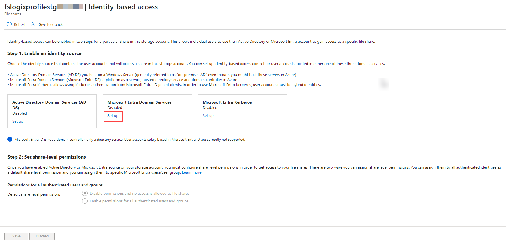

10. Select **Enable Azure Active Directory Domain Services (1)** and then click on **Save (2)**.
     
    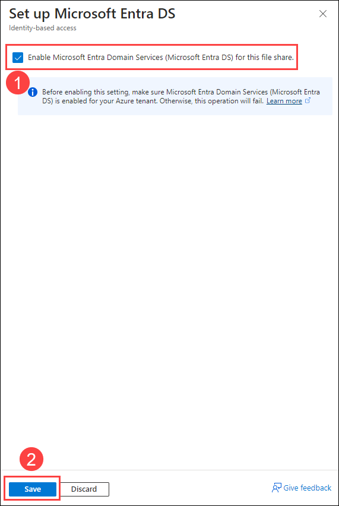
    
    >**Note:** Setting this property implicitly ***domain joins*** the storage account with the associated Azure AD DS deployment. Azure AD DS authentication over SMB is then enabled for all new and existing file shares in the storage account.
 
11. Return to the **<inject key="Storage Account Name" />**  storage account and on the left pane, click on **File shares** present under *Data Storage*, then click on **Refresh** a few times until the status of the Active Directory changes to **Configured** before continuing.

    
 
12. On **File shares** page, click on  **+ File share**.

    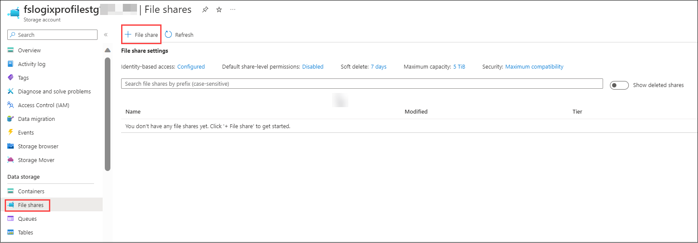
 
13. Enter the following name for your file share.
    
    - Name: **userprofile**   
    - Tier: **Transaction Optimized**
    - Click on **Review + create**, and then **Create** this will create the file share.
    
    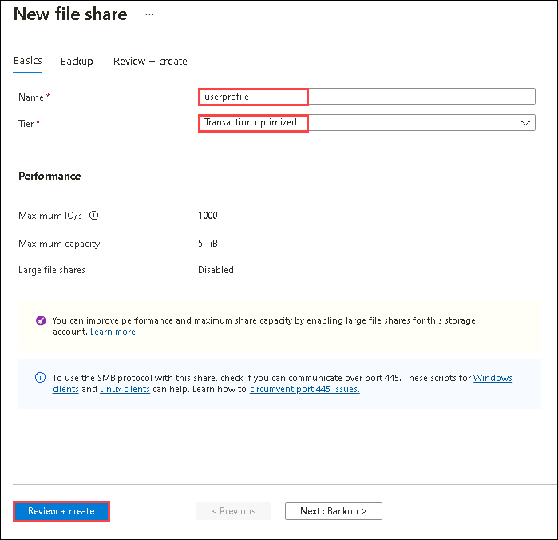

    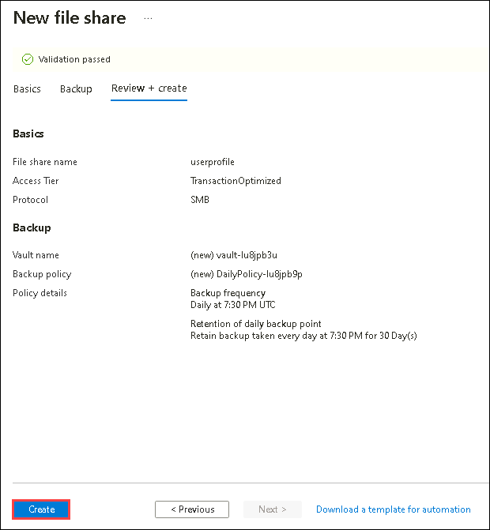

## Exercise 2: Configure File Share

In this task, we will give *Storage File Data SMB Share Contributor* permissions to **permission - fslogixcontainer** group which you'll be creating so that their profiles can be stored in the file shares.

1. Navigate to the Azure portal, then search for **Microsoft Entra ID (1)** in the search bar and select **Microsoft Entra ID (2)** from the suggestions.
   
   
   
1. Click on **Groups** under *Manage*.

   
   
1. Click on **+ New group** to add a new group.

   
   
1. Add the following configurations and leave the rest to default:

   - Group name: **permission-fslogixcontainer**
   - Click on **Create**.

   
   
1. Click on **permission - fslogixcontainer** group to open.

   
   
1. Click on **Members (1)** under **Manage** and select **+ Add members (2)**.

   
   
1. Search and select username **<inject key="AzureAdUserEmail" /> (1)** and click on **Select (2)**.

   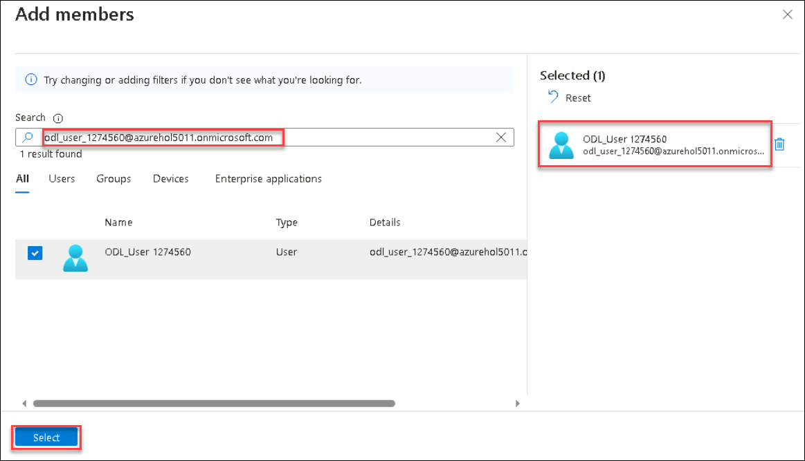
   
1. Navigate to Storage Account **<inject key="Storage Account Name" />**, select **File Shares** under Data Storage and click on **userprofile** to open file share we created earlier.

   
     
   >**Note:** The user won't have access to file share until we perform the next steps of this task. 

1. Click on **Access Control (IAM) (1)**, then click on **Add (2)** and select **Add role assignment (3)**.

   
   
1. Select the following configuration for role assignment:  
   
   - Role: Search for **Storage File Data SMB Share Contributor (1)** and select it, then click on **Next (2)**.

     
   
   >**Note:** There are three Azure built-in roles for granting share-level permissions to users:
   > - *Storage File Data SMB Share Reader* allows read access in Azure Storage file shares over SMB.
   > - *Storage File Data SMB Share Contributor* allows read, write, and delete access in Azure Storage file shares over SMB.
   > - *Storage File Data SMB Share Elevated Contributor* allows read, write, delete, and modify Windows ACLs in Azure Storage file shares over SMB.
   
   - Under the **Members** tab, follow the below steps:

      - Assign access to: Select **User, group, or service principal (1)**
      
      - Click on **+  Select members (2)**.

      - Under **Select** search paste your group **permission - fslogixcontainer (3)** and select it.
   
      - Then click on **Select (4)**.
   
         
     
      - Click on **Review + assign**

         
  
      - Click on **Review + assign**

            
     
  
## Exercise 3: Configure Session Hosts

In this task, we will install and configure FSLogix in the **AVD-HP01-SH-0** session host using a Powershell script.

1. In your Azure portal, search for **Virtual Machines** in the search bar and click on **Virtual Machines** from the suggestions.

   
      
2. Click on **AVD-HP01-SH-0**.

   
      
3. Then click on **Run command** under **Operations**.

   
  
4. Now select **RunPowerShellScript**.

   
   
5. A similar window to that of the below image will appear.

   
   
6. **Copy** the script given below and paste it by using **Ctrl + V** in the Powershell window. 

>**Note** : **Do not** run the script right away.


```
 #Variables
$storageAccountName = "NameofStorageAccount" 

#Create Directories
$LabFilesDirectory = "C:\LabFiles"

if(!(Test-path -Path "$LabFilesDirectory")){
New-Item -Path $LabFilesDirectory -ItemType Directory |Out-Null
}
if(!(Test-path -Path "$LabFilesDirectory\FSLogix")){
New-Item -Path "$LabFilesDirectory\FSLogix" -ItemType Directory |Out-Null
}

 #Download FSLogix Installation bundle

 if(!(Test-path -Path "$LabFilesDirectory\FSLogix_Apps_Installation.zip")){
       Invoke-WebRequest -Uri "https://avdv2.blob.core.windows.net/blob/FSLogix_Apps_Installation.zip" -OutFile     "$LabFilesDirectory\FSLogix_Apps_Installation.zip"

 #Extract the downloaded FSLogix bundle
 function Expand-ZIPFile($file, $destination){
     $shell = new-object -com shell.application
     $zip = $shell.NameSpace($file)
     foreach($item in $zip.items()){
     $shell.Namespace($destination).copyhere($item)
     }
 }

 Expand-ZIPFile -File "$LabFilesDirectory\FSLogix_Apps_Installation.zip" -Destination "$LabFilesDirectory\FSLogix"

}
   #Install FSLogix
   if(!(Get-WmiObject -Class Win32_Product | where vendor -eq "FSLogix, Inc." | select Name, Version)){
       $pathvargs = {C:\LabFiles\FSLogix\x64\Release\FSLogixAppsSetup.exe /quiet /install }
       Invoke-Command -ScriptBlock $pathvargs
   }
   #Create registry key 'Profiles' under 'HKLM:\SOFTWARE\FSLogix'
   $registryPath = "HKLM:\SOFTWARE\FSLogix\Profiles"
   if(!(Test-path $registryPath)){
       New-Item -Path $registryPath -Force | Out-Null
   }

   #Add registry values to enable FSLogix profiles, add VHD Locations, Delete local profile and FlipFlop Directory name
   New-ItemProperty -Path $registryPath -Name "VHDLocations" -Value "\\$storageAccountName.file.core.windows.net\userprofile" -PropertyType String -Force | Out-Null
   New-ItemProperty -Path $registryPath -Name "Enabled" -Value 1 -PropertyType DWord -Force | Out-Null
   New-ItemProperty -Path $registryPath -Name "DeleteLocalProfileWhenVHDShouldApply" -Value 1 -PropertyType DWord -Force | Out-Null
   New-ItemProperty -Path $registryPath -Name "FlipFlopProfileDirectoryName" -Value 1 -PropertyType DWord -Force | Out-Null

   #Display script completion in the console
   Write-Host "Script Executed successfully"
```
 
 
 
   
   
   >**Note:** The above script will :
   >
   >i) Install FSLogix Profile Container application
   >
   >ii) Configure the required registries
   > 
   >iii) Set the profile container location to the Azure file share location we created.
   
 
7. In line 2, we have to replace the name of the storage account with the **"NameofStorageAccount"** block.

   

8. In the script, replace **NameofStorageAccount** with **<inject key="Storage Account Name" />** and then click on **Run** to execute the script.

9. Wait for some time for the script to execute. Once done, it will show an output saying **Script Executed successfully**.

   
   
   >**Note:** It will take around five minutes for the script to execute.
   
10. Navigate to virtual machines and click on **AVD-HP01-SH-1**.

    

11. Click on **Run command (1)** under **Operations**. Then select **RunPowerShellScript (2)**.

    
        
12. **Copy** the script given below and paste it by using **Ctrl + V** in the Powershell window. 

>**Note :** **Do Not** run the script right away.


```
 #Variables
$storageAccountName = "NameofStorageAccount" 

#Create Directories
$LabFilesDirectory = "C:\LabFiles"

if(!(Test-path -Path "$LabFilesDirectory")){
New-Item -Path $LabFilesDirectory -ItemType Directory |Out-Null
}
if(!(Test-path -Path "$LabFilesDirectory\FSLogix")){
New-Item -Path "$LabFilesDirectory\FSLogix" -ItemType Directory |Out-Null
}

 #Download FSLogix Installation bundle

 if(!(Test-path -Path "$LabFilesDirectory\FSLogix_Apps_Installation.zip")){
       Invoke-WebRequest -Uri "https://avdv2.blob.core.windows.net/blob/FSLogix_Apps_Installation.zip" -OutFile     "$LabFilesDirectory\FSLogix_Apps_Installation.zip"

 #Extract the downloaded FSLogix bundle
 function Expand-ZIPFile($file, $destination){
     $shell = new-object -com shell.application
     $zip = $shell.NameSpace($file)
     foreach($item in $zip.items()){
     $shell.Namespace($destination).copyhere($item)
     }
 }

 Expand-ZIPFile -File "$LabFilesDirectory\FSLogix_Apps_Installation.zip" -Destination "$LabFilesDirectory\FSLogix"

}
   #Install FSLogix
   if(!(Get-WmiObject -Class Win32_Product | where vendor -eq "FSLogix, Inc." | select Name, Version)){
       $pathvargs = {C:\LabFiles\FSLogix\x64\Release\FSLogixAppsSetup.exe /quiet /install }
       Invoke-Command -ScriptBlock $pathvargs
   }
   #Create registry key 'Profiles' under 'HKLM:\SOFTWARE\FSLogix'
   $registryPath = "HKLM:\SOFTWARE\FSLogix\Profiles"
   if(!(Test-path $registryPath)){
       New-Item -Path $registryPath -Force | Out-Null
   }

   #Add registry values to enable FSLogix profiles, add VHD Locations, Delete local profile and FlipFlop Directory name
   New-ItemProperty -Path $registryPath -Name "VHDLocations" -Value "\\$storageAccountName.file.core.windows.net\userprofile" -PropertyType String -Force | Out-Null
   New-ItemProperty -Path $registryPath -Name "Enabled" -Value 1 -PropertyType DWord -Force | Out-Null
   New-ItemProperty -Path $registryPath -Name "DeleteLocalProfileWhenVHDShouldApply" -Value 1 -PropertyType DWord -Force | Out-Null
   New-ItemProperty -Path $registryPath -Name "FlipFlopProfileDirectoryName" -Value 1 -PropertyType DWord -Force | Out-Null

   #Display script completion in the console
   Write-Host "Script Executed successfully"
```


   
   
    
   > **Note:** The above script will :
   >
   > i) Install FSLogix Profile Container application
   > 
   > ii) Configure the required registries
   > 
   >iii) Set the profile container location to the Azure file share location we created.
 

13. In line 2, we have to replace the name of the storage account with the **"NameofStorageAccount"** block.

    

14. In the script, replace **NameofStorageAccount** with **<inject key="Storage Account Name" />** and then click on **Run** to execute the script.
       
15. Wait for some time for the script to execute.  Once done, it will show an output saying **Script Executed successfully**.

    
   
    >**Note:** It will take around five minutes for the script to execute.
  
16. Now search for *Azure virtual desktop* in the search bar and select **Azure Virtual Desktop** from the suggestions.

    
     
17. Click on **Users**, then in the search bar paste your username **<inject key="AzureAdUserEmail" />** and then click on your user.

    
    
18. Switch to **Sessions (1)** tab, then select **Host Pools (2)** and click on **Log off (3)**.

    
    
19. Click on **OK** to *Log off the user from VMs*.

    

    >**Note:** This will log off the user **<inject key="AzureAdUserEmail" />** from both the session hosts, so that when the user signs in again to the session hosts, FSLogix will start functioning.
        
20. Now paste the below-mentioned link in your browser in the JumpVM, and enter your **credentials** to log in.

    ```
    aka.ms/wvdarmweb
    ```  

    - Username: Paste username **<inject key="AzureAdUserEmail" />**, then click on **Next**.
   
    

    - Password: Paste password **<inject key="AzureAdUserPassword" />** and click on **Sign in**.

    

    >**Note:** If there's a dialog box saying ***Help us protect your account***, then select the **Skip for now** option.
    
     

21. Click on the **Session Desktop** Desktop to launch it.

    

22. Select **Allow** on the prompt asking permission to access local resources.

    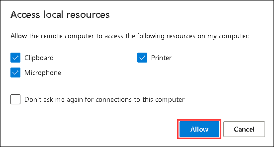

23. Enter your **Credentials** to access the desktop.

    - Username: **<inject key="AzureAdUserEmail" />**
    - Password: **<inject key="AzureAdUserPassword" />**

    
        
24. The desktop display will look similar to the screenshot below, showing ***Please wait for the FSLogix Apps Services***.

    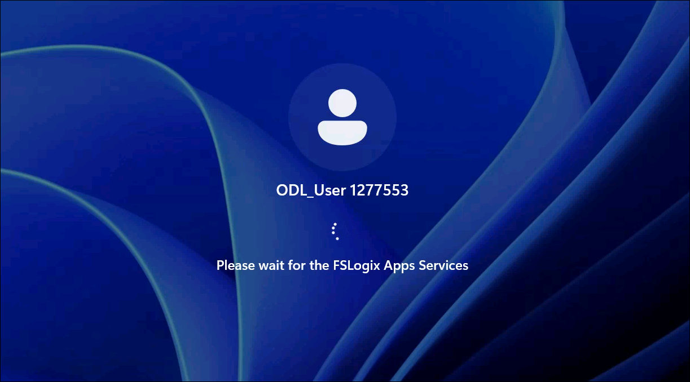
    
    >**Note:** This means that the user profile is being managed by FSLogix.

25. The virtual desktop will launch and look similar to the screenshot below.

    

26. At last, click on **User Account** and click on **Sign Out**.

    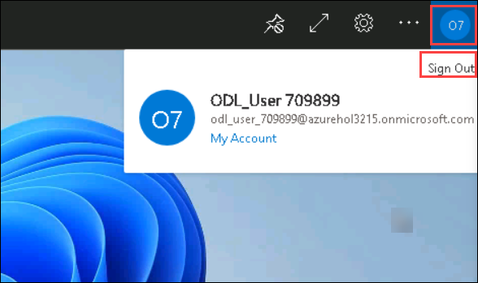
   
## Exercise 4: Verifying the User profiles stored in File Share

In this task, we will be accessing the file share to verify the user profiles stored in the *.vhd* format.

1. Return to the Azure Portal, search for *storage accounts* in the search bar and click on **Storage Accounts** from the suggestions.

   
    
2. Click on the storage account we created in **Task 1 step 3**, then under security + networking blade click on  **Networking**.

   
   
3. Under **Public network access**, select **Enabled from all networks** and click on **save icon**.

   
    
   >**Note:** This will enable access to your storage account on the public network so that you can see the user profiles stored in the file shares.
    
4. Open the storage account we created earlier, then select **Fileshare** from the left side menu.

   
      
5. Click on the **userprofile** fileshare.

   

6. Click on **Browse (1)**, and you will see the user **folder (2)** created in the file share, click on the folder.

    

7. Now you will be able to see the user profile data stored in the filesharers in a ***.vhd*** format.

   

   >**Note:** It might take some time for the User Profile folder to appear in the fileshare. If you do not see the folder now, please continue with the next task and check back later.

8. Click on the **Next** button present in the bottom-right corner of this lab guide.
